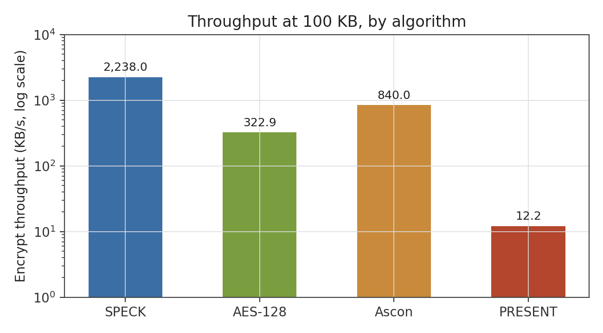
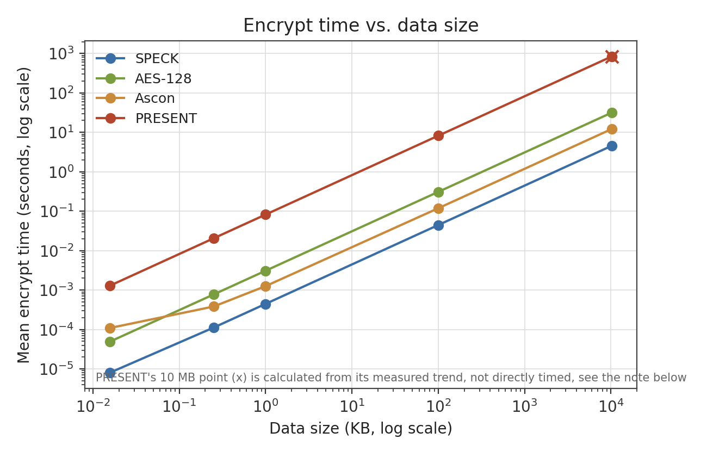
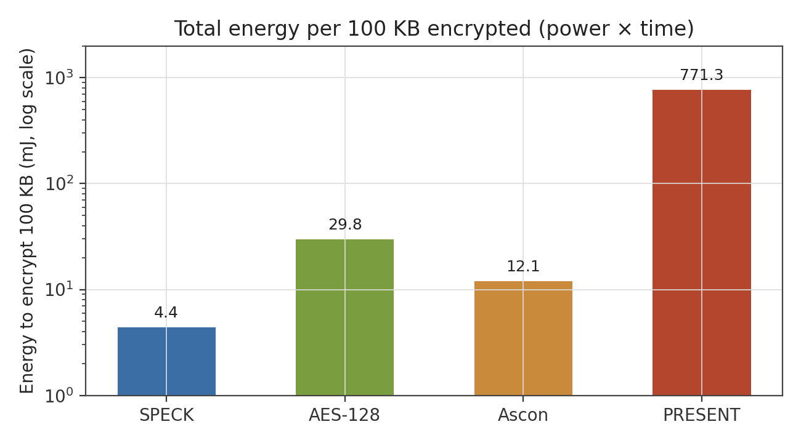
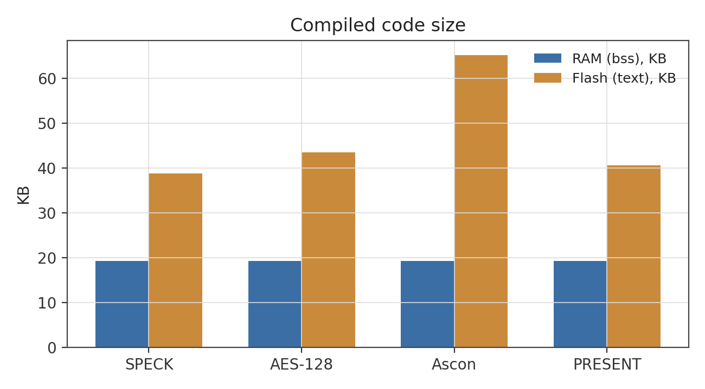
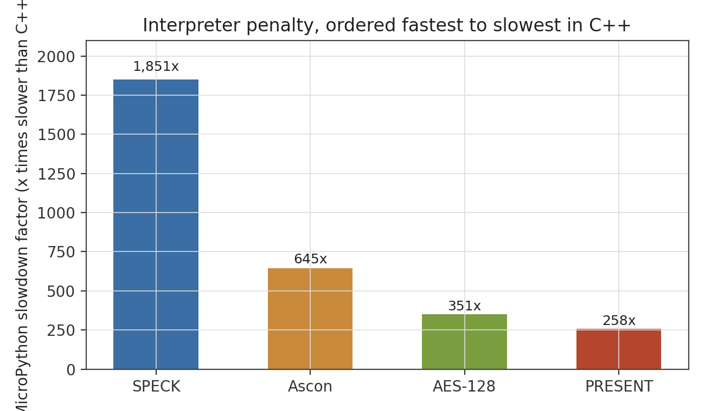
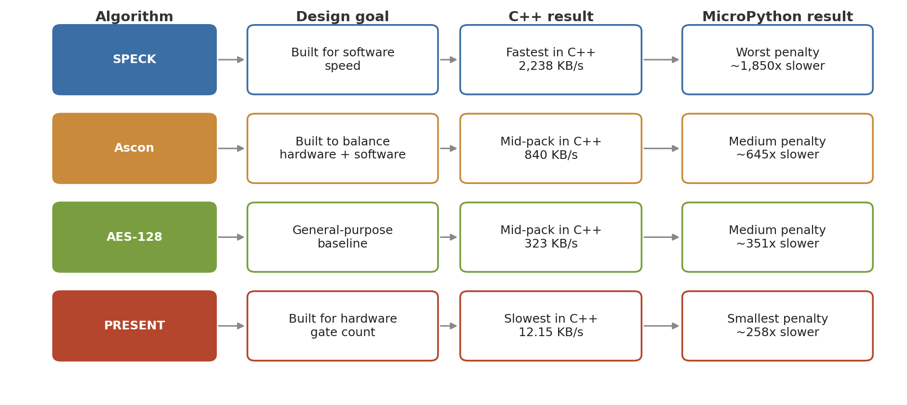

# Lightweight Encryption Benchmarks on the Raspberry Pi Pico W

Benchmarking SPECK, PRESENT, Ascon, and AES-128 on real embedded hardware, comparing
execution time, throughput, energy use, and memory footprint across four ciphers with
very different design goals, once in C++ and once in MicroPython.

## Context

This was my individual contribution to a group project for CSIT321 at the University
of Wollongong (Design and Evaluation of Lightweight Encryption Algorithms for IoT
Devices). The project had four people working on different parts; my part was
implementing all four ciphers on a Raspberry Pi Pico W and building the benchmarking
and measurement side of it end to end, in both languages, everything in this repo is
that work.

## What's here

- Four cipher implementations in C++ against the Pico SDK, bare metal, no OS
- The same four ciphers ported to MicroPython, to see how much the language itself
  changes the picture
- A shared benchmark harness measuring encrypt/decrypt time, throughput, RAM/flash
  footprint, and power draw, across data sizes from 16 bytes to 10 MB
- Every implementation verifies itself against a known-answer test vector before any
  timing is recorded

## Results

Full writeup with methodology in
[`Final_Benchmark_Report.pdf`](Final_Benchmark_Report.pdf). The headline numbers:



SPECK moves roughly 2,238 KB/s. PRESENT moves about 12. That's not a bug, it's what
each algorithm was actually built for: SPECK was designed for software speed, PRESENT
for hardware gate count (its permutation is free wiring in an ASIC, but an explicit
bit-by-bit loop in software), and Ascon was designed to hold up reasonably in both.



All four scale linearly with input size. PRESENT's 10 MB point is projected, not
measured, running it for real at full iteration count would have taken close to 48
hours given its measured throughput, so it's calculated from the throughput already
measured across four smaller sizes, which stayed flat within 0.01 KB/s of each other
over a 6,400x range of input sizes.



Instantaneous power draw looks almost identical across all four algorithms while
they're running, current stays in the same 0.017-0.020 A band no matter which cipher
is active. Reporting that number alone would make them look equally efficient, and
that's misleading. Energy is power multiplied by time, so PRESENT taking 184x longer
than SPECK to do the same job means it burns roughly 175x more total energy, even
though an ammeter watching it run barely notices a difference.



| | SPECK | AES-128 | Ascon | PRESENT |
|---|---|---|---|---|
| Encrypt throughput (100 KB, C++) | 2,238 KB/s | 322.9 KB/s | 839.9 KB/s | 12.15 KB/s |
| Energy per 100 KB encrypted (C++) | ~4.4 mJ | ~29.8 mJ | ~12.1 mJ | ~771.3 mJ |
| RAM (bss, C++) | 19.2 KB | 19.20 KB | 19.21 KB | 19.26 KB |
| Flash (text, C++) | 38.8 KB | 43.51 KB | 65.20 KB | 40.55 KB |

### Does the language matter?



Every algorithm got slower moving from C++ to MicroPython, expected since an
interpreted language reading code line by line will always lose to something
compiled ahead of time. What's not obvious going in is that the penalty isn't the
same size for every algorithm. SPECK, the fastest algorithm in C++, took the worst
hit in MicroPython, about 1,850x slower. PRESENT, the slowest algorithm in C++, took
the smallest hit, about 258x slower. An algorithm that was cheap to begin with has a
lot further to fall than one that was already expensive, so the language you build
in doesn't just add a flat tax across the board, it changes how the algorithms
compare to each other.



## Building the C++ version

Needs Pico SDK v1.5.1, CMake, Ninja, arm-none-eabi-gcc, and a UM24C or similar inline
USB power meter if you want to reproduce the energy numbers.

```
cd cpp_benchmark/<algorithm>_benchmark
mkdir build && cd build
cmake .. -G "Ninja"
ninja
```

Hold BOOTSEL, plug in USB, then copy the resulting `.uf2` to the Pico's bootloader
drive. Open a serial monitor at 115200 baud to watch it run.

## Running the MicroPython version

This needs actual MicroPython firmware flashed onto the board first, and that
completely replaces whatever C++ build was on there, so it's a separate round, not
something you run alongside the C++ side.

Flash the firmware the same way as any other `.uf2`, hold BOOTSEL, plug in, copy the
MicroPython build over. Then, from a normal terminal with
[`mpremote`](https://pypi.org/project/mpremote/) installed:

```
pip install mpremote
mpremote run micropython_benchmark/<algorithm>_benchmark.py
```

Output streams straight into the terminal, correctness check first, then each data
size in turn, same UM24C prompts as the C++ version. The larger sizes get genuinely
impractical here, PRESENT alone would need multiple days for a full run at 100 KB, so
most of the MicroPython numbers past 1 KB in the report are projected from the
smaller sizes that were actually timed instead of run to completion.

## Why this project

IoT devices are usually too resource-constrained to run AES-128 the way a server or
phone would. That's the whole reason lightweight cryptography exists as a research
area. The interesting part isn't just picking a winner, it's that a cipher optimised
for one context (hardware gate count, in PRESENT's case) can perform badly in another
(general-purpose software), and that the language you actually build in changes how
much that matters. Both of those are things anyone choosing an algorithm for a real
constrained device needs to think about, not just whatever a spec sheet says on its
own.
